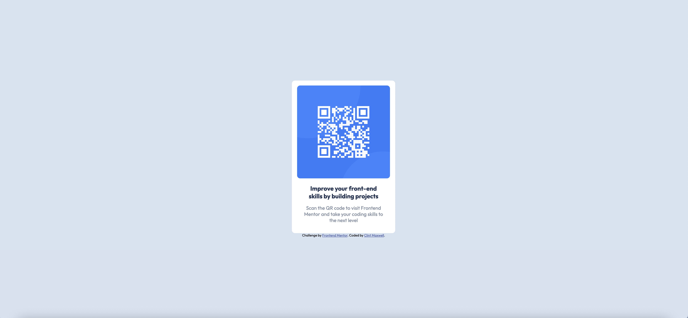
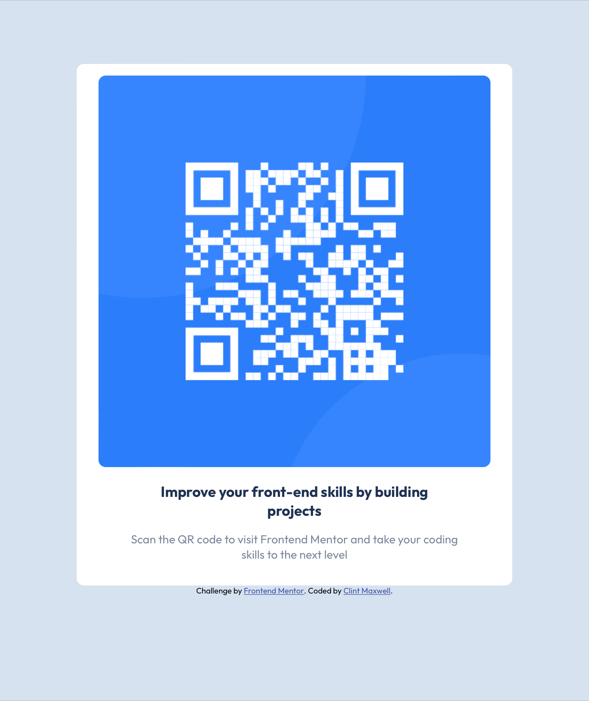

# Frontend Mentor - QR code component solution

This is a solution to the [QR code component challenge on Frontend Mentor](https://www.frontendmentor.io/challenges/qr-code-component-iux_sIO_H). Frontend Mentor challenges help you improve your coding skills by building realistic projects.

## Table of contents

- [Overview](#overview)
  - [Screenshot](#screenshot)
  - [Links](#links)
- [My process](#my-process)
  - [Built with](#built-with)
  - [What I learned](#what-i-learned)
  - [Continued development](#continued-development)
  - [Useful resources](#useful-resources)
- [Author](#author)

## Overview

### Screenshots

#### Desktop Version

#### Tablet Version

#### Mobile Version

### Links

- Solution URL: [https://www.frontendmentor.io/challenges/qr-code-component-iux_sIO_H/hub/responsive-landing-page-using-css-flexbox-JNc_5hYRude](https://www.frontendmentor.io/challenges/qr-code-component-iux_sIO_H/hub/responsive-landing-page-using-css-flexbox-JNc_5hYRud)
- Live Site URL: [https://antoniohoutx.github.io/qr-code-component-main/](https://antoniohoutx.github.io/qr-code-component-main/)

## My process

### Built with

- Semantic HTML5 markup
- CSS custom properties
- Flexbox

### What I learned

I learned the challenging aspect of responsive web design.  Web development sometimes is not necessarily a "one-size-fits-all" proposition.

### Continued development

I would still like to focus on centering the main element on a variety of screen widths, as well as improve my grasp of media queries to make my websites more responsive.

### Useful resources

- [MDN Web Docs](https://developer.mozilla.org/en-US/) - As always, my go-to resource for anything HTML, CSS, or JavaScript-related.

## Author

- Frontend Mentor - [@AntonioHouTX](https://www.frontendmentor.io/profile/AntonioHouTX)
- Twitter - [@clintmaxwell](https://www.twitter.com/clintmaxwell)
